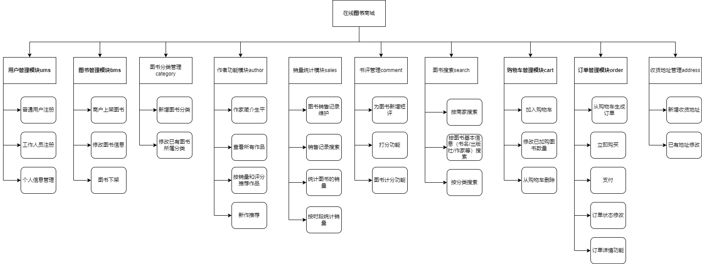

# 在线图书销售系统 设计文档

本文档说明**在线图书销售系统**的模块设计。

## 系统模块概述

在线图书销售系统的总体模块设计如下：

系统一共有**八个模块**：

- [用户管理模块ums](design/用户管理模块.md)：买家和商家的账号信息管理、新帐号注册、商家信息维护等。
- [图书管理模块bms](design/图书管理模块.md)：专注图书信息管理。负责图书上下架、已有图书信息修改。
- 图书分类管理模块category：支持多级分类添加与管理。
- 图书评论管理模块comment：支持对图书添加短评，并基于此计算图书得分。
- 购物车模块cart：用户可以加购图书，并在购物车页面修改已加购商品。
- 订单模块order：由购物车生成订单、立即购买生成订单、支付功能、订单状态修改以及订单详情历史功能。
- 收货地址管理模块address：用户可以管理自己的收货地址与默认地址。
- 图书搜索模块search：支持基于图书基本信息的搜索、图书分类搜索与按商家的搜索。
